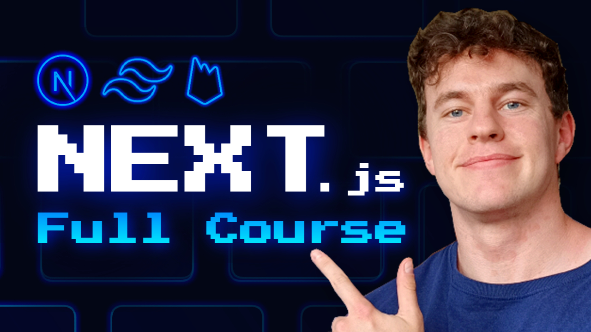

# NEXT.js 14 Full Course | Build and Deploy a Full Stack Mood Tracking App w/ Firebase & TailwindCSS 🔥

Ready to master full stack development with **Next.js 14**? In this course, we'll guide you step-by-step in building a super cool, full stack mood tracking application that will help you stand out as a full stack developer. Using **Next.js 14**, **Firebase**, and **TailwindCSS**, you'll create a modern and dynamic project that not only looks fantastic but is also feature-rich and fully deployable. By the end, you'll have a portfolio-worthy app that showcases your skills as a full stack developer!

## The Course Includes

🔥 4+ hours of on-demand video.  
⭐️ [Companion Notes](https://smoljames.com/notes).  
🧪 Access on mobile and TV.  
🏆 Build and deploy a fully functional, cutting-edge mood tracking application.

## Requirements

- No Next.js coding experience required! We'll take you from absolute beginner to pro, one step at a time.
- Any computer with Windows, macOS, or Linux will do. We'll help you set up your development environment.
- Some basic knowledge of HTML, CSS, JavaScript, and React.js is helpful.

**Need to brush up on these topics?** Check out full courses for each [here](https://www.smoljames.com/roadmap).

## Description

### Why is this the right Next.js course for you?

This course will teach you how to build a full stack app with **Next.js 14**, but more importantly, it teaches you by building something fun, practical, and impressive—a **Mood Tracking App**. Through this exciting project, you'll learn the ins and outs of modern full stack development using **Next.js 14**, **Firebase** for authentication and database, and **TailwindCSS** for rapid and responsive design.

Instead of spending countless hours on theory, we dive right into building an actual application that you can show off to potential employers or clients. Plus, we'll deploy it live, so you'll have a working link to share with the world!

### What you'll build:

In this course, you will build a complete **Mood Tracking Application** from scratch. This includes:

- **User Authentication** with Firebase.
- **Mood Tracking Features** where users can log their daily emotions.
- **Data Visualization** to show mood trends over time.
- **Beautiful UI** crafted with TailwindCSS for a clean, modern look.
- **Real-Time Updates** using Firebase Firestore for seamless data management.

### Course Structure

- **Chapter 1: Setting Up Next.js and Firebase**  
  We'll start by setting up your development environment and getting comfortable with Next.js 14 and Firebase. You'll learn how to connect your app to Firebase, manage authentication, and set up Firestore as your database.

- **Chapter 2: Building the Mood Tracker**  
  This chapter focuses on building out the core features of your mood tracking app. We'll implement the user interface, allow users to log their mood, and store data in Firebase.

- **Chapter 3: Enhancing with TailwindCSS**  
  Learn how to style your application with TailwindCSS to create a responsive, modern UI that looks amazing on any device.

- **Chapter 4: Deploying Your App**  
  Once your app is built, we'll walk you through deploying it to a live server, ensuring you have a fully functional application ready to showcase.

### Why am I the right Next.js teacher for you?

My name is James, and I’ve helped over 500,000 people learn to code. I know what it’s like to struggle with learning a new technology, but I’ve designed this course to be approachable, hands-on, and fun. With my experience in teaching and web development, I’ll guide you from zero to hero, helping you not just understand Next.js but apply it in real-world projects.

By the end of this course, you'll be equipped with the skills and confidence to build and deploy modern full stack applications with Next.js, ace technical interviews, and land that developer job you’ve been dreaming of.

## Instructor

James is a self-taught software developer with a background in civil engineering. With over a decade of experience teaching programming, math, and science, he’s passionate about making learning fun and accessible to everyone. You can connect with James on [Discord](https://discord.gg/BYr6gujs4k) or [LinkedIn](https://www.linkedin.com/in/jamezmcarthur/).

* https://www.smoljames.com

